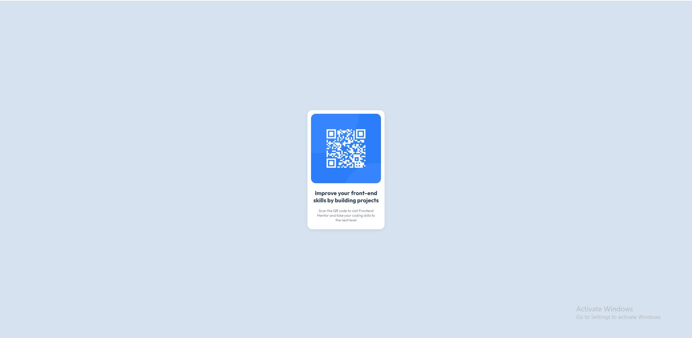

# Frontend Mentor - QR code component solution

This is a solution to the [QR code component challenge on Frontend Mentor](https://www.frontendmentor.io/challenges/qr-code-component-iux_sIO_H).

## Overview

I am using CSS Flexbox layout model for centering my "card" component horizontally and vertically:

1. For centering horizontally i used "justify-content: center".
2. Since by default flex items are filling vertical space of their parent element (which is here "body"), i used "align-items: center (for aligning "card" on the cross axis).

### Screenshot

## My process

### Built with

- Semantic HTML5 markup
- CSS Colors, Padding, Margin, Fonts and Sizes
- Flexbox

## URL

https://qrcode-teona.netlify.app/
